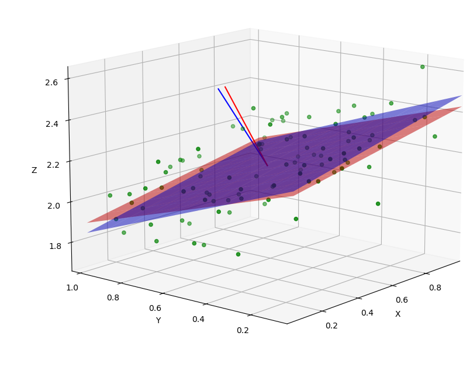

# Fit Plane In 3D
This short repo shows by example 3 different methods to fit a plane to 3D points. In general, the best way to fit a plane to 3D points is to first remove the centroid from the point coordinates and then either use the eigenvalues and eigenvectors of the points (method 1) or the singular value decomposition (SVD) of the points (method 2). Both methods yield similar results.

### Method 1- Eigenvalues and eigenvectors
1. First, we need to remove the centroid from 3D points which is also known as normalizing point coordinates. The centroid for points that are supposed to belong to a plane in 3D space is located at a location described by the mean value of X, Y, and Z coordinates of said points.
2. Next, we compute the eigen values and eigne vectors of the normalized points. Eigen vectors in this 3D space define an orthogonal space of principal components of the points. Respective eigen values show a measure of dispersion along those axes (principal components).
3. The smallest eigen value points to the principal axis of least amount of dispersion, which is the normal vector to the plane we are trying to fit to these points. Therefore, the eigen vector corresponding to the smallest eigen value is the normal to the plane.
4. In most applications (such as aerial surveying), the planes that we are interested in are pointed away from the surface. Therefore, if the Z value of the normal vector is not positive, we can invert the normal vector by multiplying the vector by -1.

### Method 2- Singular Value Decomposition (SVD)
1. Similar to Eigen method, we calculate the normalized point coordinates (centroid removed coordinates).
2. We calculate the singular value decomposition of the normalized coordinates matrix (n by 3).
3. The singular vector corresponding to the smallest singular value is the normal vector to the best fit plane to our points.
4. Similar to Eigen method, if the normal vector is not pointing up, we can multiply the normal by -1.
5. The standard deviation of misclosure values (also known as standard deviation of the residuals) can be calculated by dividing the smallest singular value by square root of the number of points $$ σr = {\min(sv) \over \sqrt{n}} $$

### Method 3- Fitting a 3D plane to 3D points using least squares fitting using a Z-axis constraint
1. First we set up the equations using the Z-axis constraint.
2. 

## Results
Because we create the 3D points randomly, every run of the code will be slightly different. Here are a sample set of results:

---- Method 1: Using Eigen -----
normal vector: **[-0.212,  0.384,  0.898]**
std of residuals: **0.112**

---- Method 2: Using SVD ----- 
normal vector: **[-0.212,  0.384,  0.898]**
std of residuals: **0.112**

---- Method 3: Using Least Squares Along Z axis ----- 
normal vector: **[-0.186,  0.328,  0.926]**
std of residuals: **0.123**

----------------------------------
angular difference between normal vectors calculated from SVD and least squares is **3.908** degrees

# Plots
Now, let's plot all the results:
* Original 3D points are plotted in green
* Best fit plane obtained from either SVD or Eigen approaches is plotted in blue
* Plane fitted by Least Squares method with Z-axis constraint is plotted in red
* Normal to best fit plane is plotted as a blue line
* Normal to least squares fit plane is plotted as a red line

You can see that there is a clear distinction between the two planes, proving that the least squares adjustment plane fitting with Z-axis constraint is not the best solution and does not quite achieve similar results to SVD or Eigen approaches. In this example, the angular difference between the normal to SVD plane and the normal to least squares plane is about 3.16 degrees.

